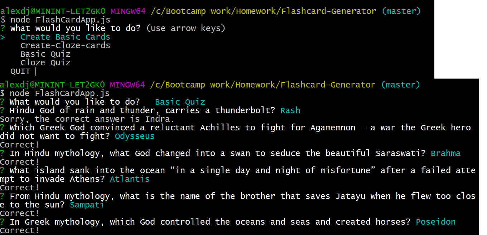
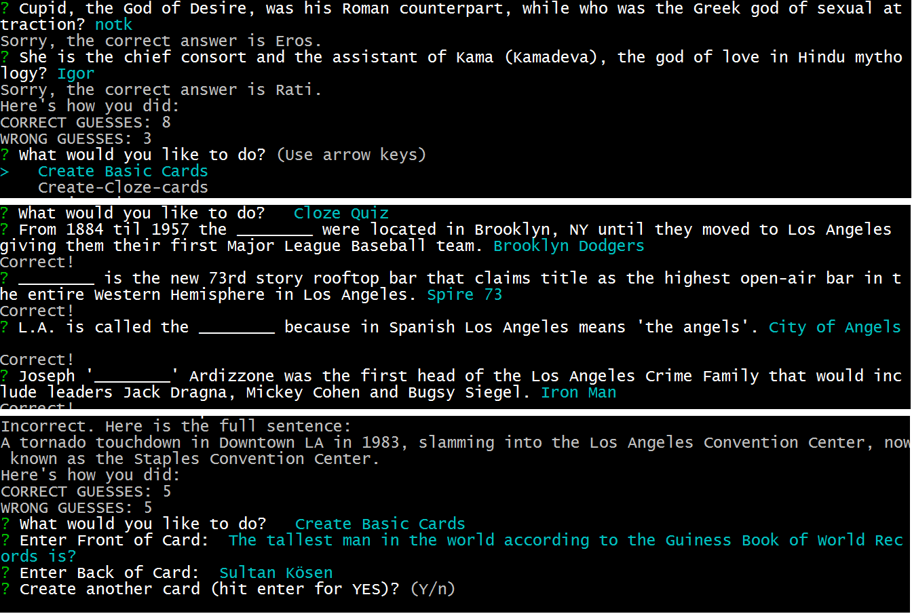
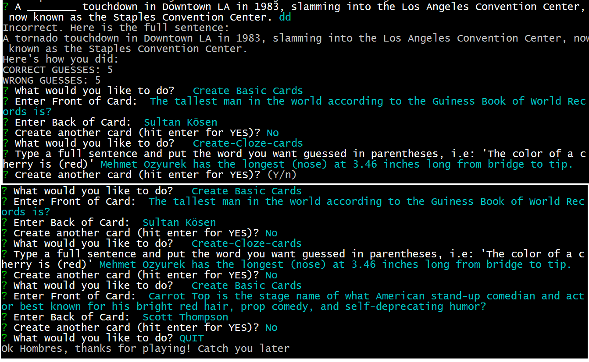

#  ****FLASH CARD GENERATOR****

## What is this app anyways???

This is a fun command-line based trivia flash card game where the user is prompted with questions and shown the correct answer after making a guess. 

The right and wrong answers are tallied up and the total is displayed at the end of the game.

# Flashcard-Generator :card_index:
This Flashcard Generator is designed to be user-friendly.  RUN 'node FlashCardApp.js' in your command line, and the CLI will guide you through the process of creating both Basic and Cloze-deleted flashcards.  Your cards will be saved into log.txt and cloze-log.txt, respectively.  The Flashcard Generator also allows you to quiz yourself using the cards you created.

## Table of Contents

- [Install and Use this App](#how-to-install-and-use-this-app)
- [Creating a Basic Flashcard](#creating-basic-flashcards)
- [Creating a Cloze Flashcard](#creating-cloze-flashcards)
- [Taking a quiz](#quizes)
- [Improvements I'd like to make...](#improvements-i-d-like-to-make)

##  How to Install and Use this app

From a directory of your choosing, simply clone this repository.  Install the 'inquirer.js' and 'node.js' dependency modules from the command line, and RUN 'node FlashCardApp.js' to start the app.

##  Creating Basic Flashcards

Creating basic flashcards is very easy. Each card will display a question on the front and its answer on the back. Just use the arrow keys to navigate to 'Create Basic Card' from the command line menu.  Follow the prompts and in no time flat, you're creating the front and back of a card.  You'll have the option to make more basic cards or perform different tasks.

##  Creating Cloze Flashcards

Creating Cloze cards also couldn't be easier.  Choose 'Create Cloze Cards' from the CLI menu and you'll be prompted to enter a sentence, with a word or phrase hidden in parentheses.  The omitted word/phrase can be placed anywhere in the sentence as follows:

    --    The (Salt Lick) is one of the most famous BBQ joints in Austin, Texas.

    --    The capital of Texas is (Austin).

##  Quizes

It is also easy to quiz yourself using the flashcards you created.  Choose the 'basic-quiz' or 'cloze-quiz' option, depending which set of cards you'd like to access. The basic quiz will present the front of your card and allow you to type in the answer.  The cloze quiz will present your cloze cards with a blank replacing the hidden word/s.  In both cases, the program will let you know whether each answer was correct and tally your score at the end.  

##  Improvements I'd like to make...

Here's a short list of things I'd like to incorporate sometime in the future....

    --Deleting cards through the interface
    --Editing cards through the interface
    --Using a database like MongoDB
    --Creating a really cool, responsive, animated, web-based front-end :D